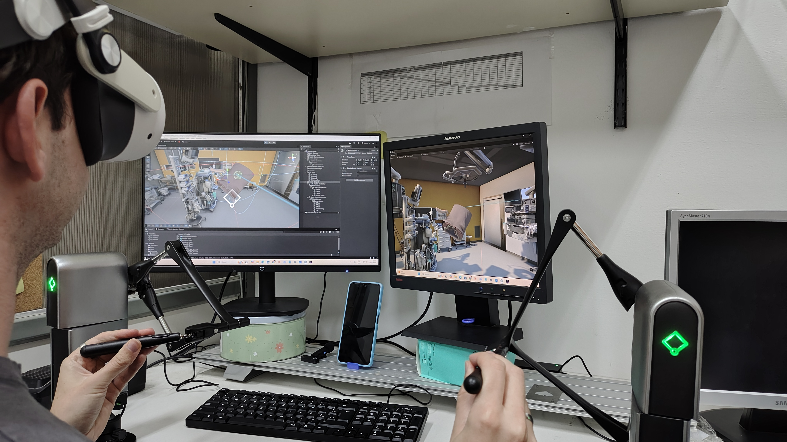
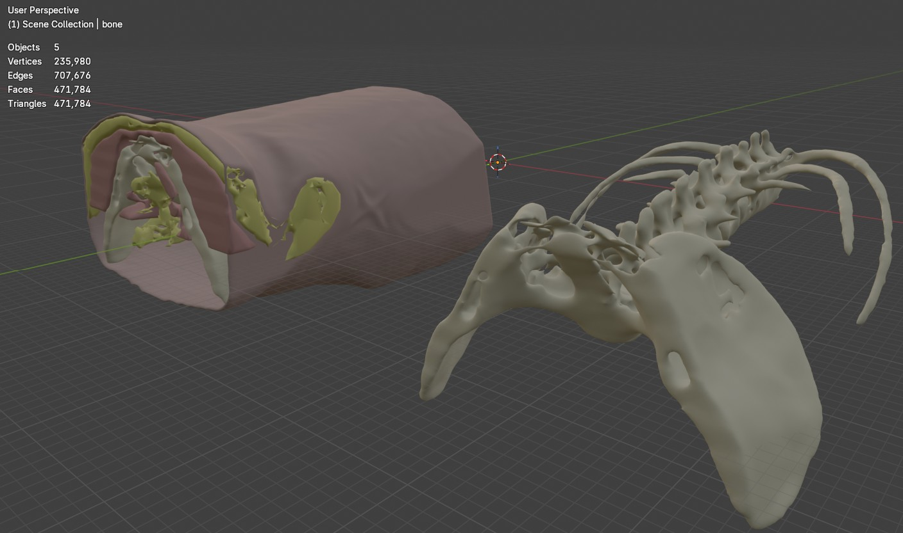

# Lumbar Puncture VR Simulator with Haptic Feedback

A VR medical simulator for training healthcare professionals in lumbar puncture (LP) procedures, combining immersive virtual reality with haptic feedback to replicate the physical sensation of the technique.

> **Undergraduate thesis project** — Biomedical Engineering, Universidad Nacional de Entre Ríos (UNER), developed in collaboration with Hospital San Martín de Paraná.

---

*Resident interacting with the simulator — Meta Quest 3 + Haply Inverse3 haptic device + medical interface*

---

## Problem & Motivation

Lumbar puncture is a critical clinical procedure with a steep learning curve. In Argentina and across much of the world, most medical residents perform their first LP directly on a patient — there are simply no accessible alternatives for prior practice.

This reality was confirmed by the Head of Emergency Medicine at Hospital San Martín de Paraná, who described calling all available residents whenever he performs an LP so they can at least observe the procedure. Existing physical simulators are expensive, limited in quantity, and wear out with use.

Our simulator addresses this gap by providing an accessible, repeatable, and scientifically grounded training tool.

---

## What the Simulator Trains

The simulator covers two of the most critical phases of a lumbar puncture:

**1. Anatomical landmark identification**
The resident must locate the correct insertion point through virtual palpation, guided by anatomical references and haptic feedback that simulates tissue resistance under the fingertip.

**2. The puncture itself**
The system evaluates three key parameters in real time:
- Needle **insertion angle**
- **Entry point** accuracy relative to the correct anatomical location
- **Insertion speed**

Visual overlays in VR provide pedagogical feedback — showing the correct angle, highlighting the target zone — while the haptic device simulates the distinct resistance layers encountered as the needle passes through skin, ligaments, and reaches the subarachnoid space.

---

## Anatomical Model

The 3D model used in the simulation was obtained from a real CT scan, processed through a clinical-to-3D pipeline:

1. **Slicer3D** — segmentation of lumbar vertebrae and surrounding soft tissue from DICOM data
2. **Blender** — mesh cleanup, optimization, and preparation for real-time rendering in Unity

*Processed anatomical model of the lumbar region*

---

## System Architecture

The simulator integrates three main components working in parallel:

| Component | Technology | Role |
|-----------|-----------|------|
| VR Environment | Unity / C# / Meta XR SDK | Immersive rendering, pedagogical overlays, scene management |
| Haptic System | Haply Inverse3 + C# | Force feedback simulation for palpation and needle insertion |
| Anatomical Model | Slicer3D + Blender → Unity | Patient geometry for visual and haptic reference |

The haptic feedback is driven by mathematical models that differentiate tissue resistance at multiple anatomical depths. These models were defined based on a structured survey of 10 expert physicians and will be refined through calibration sessions with 3 additional medical professionals before final validation.

---

## Development Methodology

The project follows a rigorous scientific framework as part of an undergraduate thesis, grounded in a systematic literature review of existing LP simulators and haptic feedback systems.

**Phase 1 — Expert Survey**
A structured questionnaire was applied to 10 physicians experienced in LP procedures. The survey captured both the haptic requirements (what tissue resistances should feel like) and the pedagogical requirements (what errors are most critical to address). Results informed the simulator's design decisions.

**Phase 2 — Development** *(current phase)*
Parallel development of the VR environment, haptic integration, and anatomical model, with iterative testing against clinical requirements gathered in Phase 1.

**Phase 3 — Haptic Calibration**
Three medical professionals will interact with the simulator and provide feedback to tune the mathematical models, adjusting force parameters to match real procedural feel.

**Phase 4 — Usability Validation**
A minimum of 7 physicians (separate from the calibration group) will use the simulator and complete a validated usability questionnaire assessing:
- Perceived realism of the haptic experience
- Perceived educational potential
- Ease of use

---

## Tech Stack

- **Game Engine**: Unity (C#) with Meta XR All-in-One SDK
- **VR Platform**: Meta Quest 3
- **Haptic Device**: Haply Inverse3
- **3D Modeling**: Slicer3D (medical segmentation) + Blender (mesh processing)
- **Target Platform**: Standalone VR + tethered haptic device

---

## Team

| Name | Role |
|------|------|
| **Lucio Sepúlveda** | Co-developer — VR, haptic integration, system architecture & clinical liaison |
| **Facundo Schneider** | Co-developer — VR, haptic integration |

In collaboration with the medical team at **Hospital San Martín de Paraná** for clinical requirements, iterative validation, and usability testing.

**Academic context**: Undergraduate thesis — Biomedical Engineering, Facultad de Ingeniería, UNER.

---

## Project Status

| Milestone | Status |
|-----------|--------|
| Expert survey (n=10) | ✅ Completed |
| Anatomical model (CT → Unity) | ✅ Completed |
| VR environment & pedagogical overlays | 🔄 In development |
| Haptic feedback integration | 🔄 In development |
| Haptic calibration (n=3 physicians) | ⏳ Pending |
| Usability validation (n≥7 physicians) | ⏳ Pending |

---

> **Note on code availability**: This repository contains documentation and media only. The source code is not publicly available as the project is under active development as part of an ongoing thesis.
